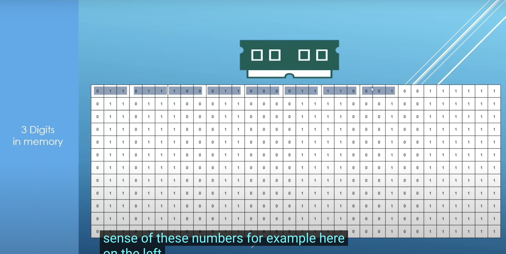
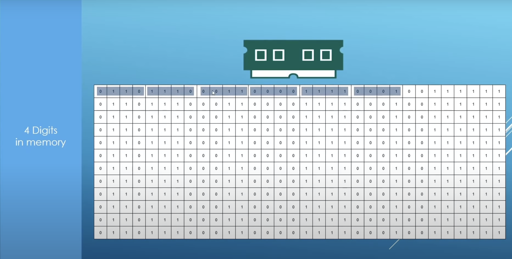

# CH 3 Variables And Data Types

# 3.2 Number Systems

Time : | 3h : 05m : 06s |
Code : | |
* [main.cpp](./main.cpp)
* [Home](/README.md)

---

## Introduction

>Number Systems
>* Binary
>* Octal
>* Hexadecimal

Number Systems allow us to Transform the data from the form that is really convenient for humans in a form that is convenient for computers in these ones and zeros or we use them to reverse zero and ones to human readable form.

### Base 10 Decimal System

||Number|Base 10 Representation|
|-|-|-|
| Base 10 | 2371 |2 x 103 + 3 x 102 + 7 x 101 + 1 x 100|
| Base 10 | 924  |9 x 102 + 2 x 101 + 4 x 100|
| Base 10 | 47   |4 x 101 + 7 x 100|

### Binary or Base 2

>Binary Number or Base Two : they have only two states or zero or one.

||Number|Base 2 Representation|
|-|-|-|
| Base 2 | 100101 |1 x 25 + 0 x 24 + 0 x 23 + 1 x 22 + 0 x 21 + 1 x 20|
| Base 2 | 10010 |1 x 24 + 0 x 23 + 0 x 22 + 1 x 21 + 0 x 2 0|
| Base 2 | 111 |1 x 22 + 1 x 21 + 1 x 20|

---

## Decimal And Binary

### 3 Digits Binary & Decimals

| Digits | Binary | Decimal |
|--------|--------|---------|
| Digit 3 | 000 | 0 |
| Digit 3 | 001 | 1 |
| Digit 3 | 010 | 2 |
| Digit 3 | 011 | 3 |
| Digit 3 | 100 | 4 |
| Digit 3 | 101 | 5 |
| Digit 3 | 110 | 6 |
| Digit 3 | 111 | 7 |

### 4 Digit Binary and Decimals

| Digits | Binary | Decimal |
|--------|--------|---------|
| Digit 4 | 0000 | 0 |
| Digit 4 | 0001 | 1 |
| Digit 4 | 0010 | 2 |
| Digit 4 | 0011 | 3 |
| Digit 4 | 0100 | 4 |
| Digit 4 | 0101 | 5 |
| Digit 4 | 0110 | 6 |
| Digit 4 | 0111 | 7 |
| Digit 4 | 1000 | 8 |
| Digit 4 | 1001 | 9 |
| Digit 4 | 1010 | 10 |
| Digit 4 | 1011 | 11 |
| Digit 4 | 1100 | 12 |
| Digit 4 | 1101 | 13 |
| Digit 4 | 1110 | 14 |
| Digit 4 | 1111 | 15 |

### 5 Digit Binar And Decimal

| Digits  | Binary | Decimal | | Digits  | Binary | Decinmal|
|---------|------- |---------|-|---------|--------|---------|
| Digit 5 | 00000  | 0       | | Digit 5 | 10001  | 17      |
| Digit 5 | 00001  | 1       | | Digit 5 | 10010  | 18      |
| Digit 5 | 00010  | 2       | | Digit 5 | 10011  | 19      |
| Digit 5 | 00011  | 3       | | Digit 5 | 10100  | 20      |
| Digit 5 | 00100  | 4       | | Digit 5 | 10101  | 21      |
| Digit 5 | 00101  | 5       | | Digit 5 | 10110  | 22      |
| Digit 5 | 00110  | 6       | | Digit 5 | 10111  | 23      |
| Digit 5 | 00111  | 7       | | Digit 5 | 11000  | 24      |
| Digit 5 | 01000  | 8       | | Digit 5 | 11001  | 25      |
| Digit 5 | 01001  | 9       | | Digit 5 | 11010  | 26      |
| Digit 5 | 01010  | 10      | | Digit 5 | 11011  | 27      |
| Digit 5 | 01011  | 11      | | Digit 5 | 11100  | 28      |
| Digit 5 | 01100  | 12      | | Digit 5 | 11101  | 29      |
| Digit 5 | 01101  | 13      | | Digit 5 | 11110  | 30      |
| Digit 5 | 01110  | 14      | | Digit 5 | -----  | 31      |
| Digit 5 | 01111  | 15      | | Digit 5 | 11111  | 32      |
| Digit 5 | 10000  | 16      |

> 5 digit Binary In memory

