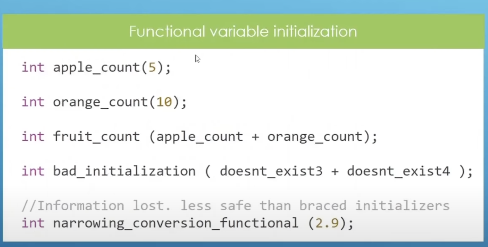
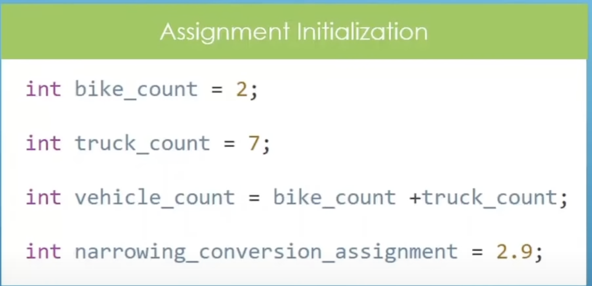

# CH 3 Variables And Data Types

# 3.3 Integers Type : Integer and Decimals

Time : | 3h : 21m : 53s |
Code : | 3H : 29M : 34S |
* [main.cpp](./main.cpp)
* [Home](/README.md)

---

## Integers

> `int`
>* Stores decimals
>* Typically occupies 4 bytes or more in memory
>* Integer in Memory

> Variable : A Named piece of memory that you use to store specific types of data.

---

## VARIABLE INITIALIZATION

* Braced Initialization
* functional initialization
* Assignment initialization

### Variable Braced initialization

### Functional Variable initalization

### Assignment Initialization

## Size of a Type in Memory

>representation of `int` in memory

## Variables

> Variable initialization
