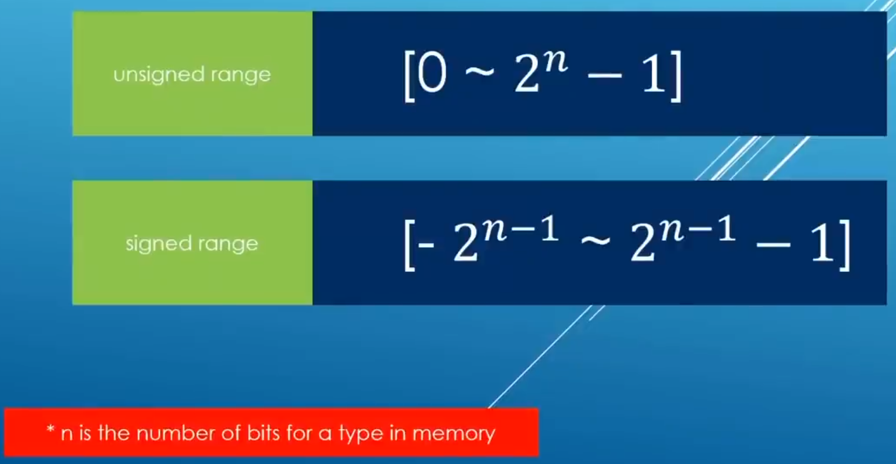
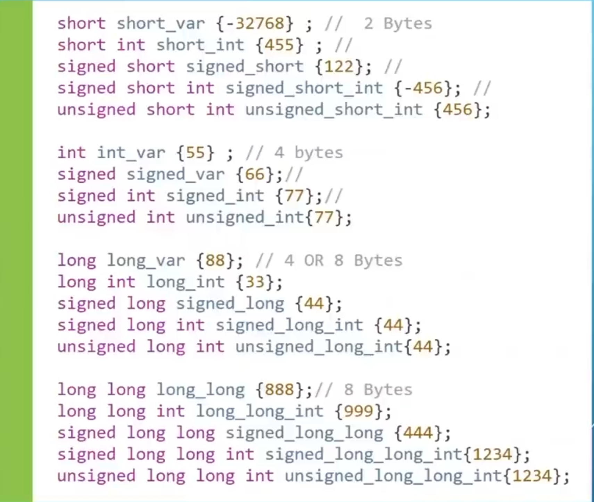

# CH 3 Variables And Data Types

# 3.4 Integer Modifiers

Time : | 3h : 40m : 45s |
Code : | |
* [main.cpp](./main.cpp)
* [Home](/README.md)

---

## Positive And Negative Numbers

    >> int value1{10};
    >> int value2{-399}
    >> 
    >> signed int value1{10};
    >> signed int value2{-300};

> Note: `signed` or `unsigned` both store the same amount of data (4 bytes).

## short And Long 

>Note:
>* `short int` can have memory storage of 2 byte And `long int` can have 8 bytes.
>* These modifiers only apply to integral types : those in which you can store decimal numbers
