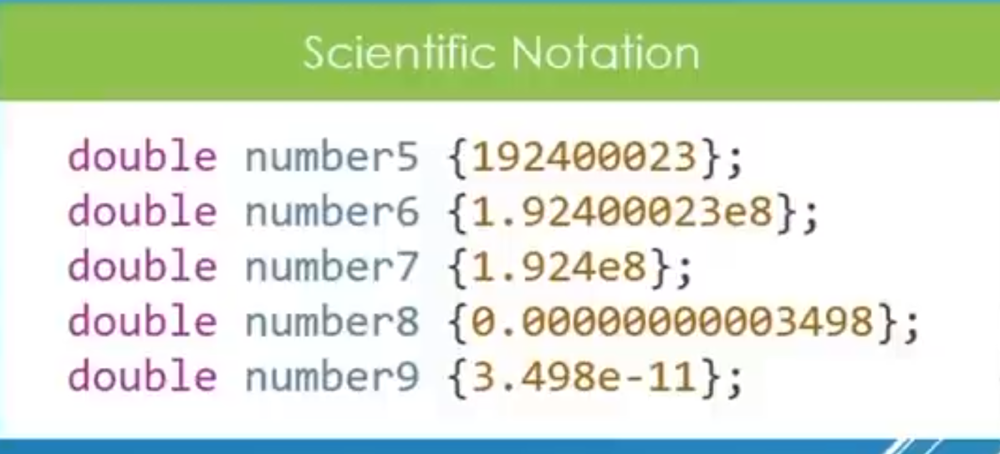
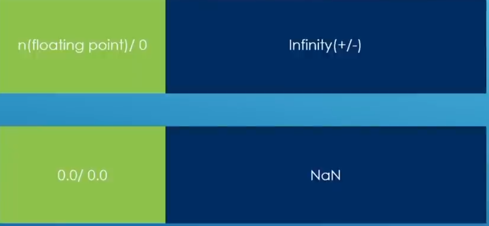

# CH 3 Variables And Data Types

# 3.5 Fractional Numbers

Time : | 3h : 54m : 02s |
Code : | 4h : 03m : 44s |
RemTime | 26h : 50m : 49s |
* [main.cpp](./main.cpp)
* [Home](/README.md)

---

## Floating Point Types

>* Used to Represent numbers with Fractional Parts in C++.

>* Precision: is numbers after decimal point.
> `1.23456789001` this number have 12 precision.

Result :

    3.5 Fractional Numbers
     == == == == == == == == == == == == == == == == == == == == == == == == == == == == == 
    sizeOf float : 4
    sizeOf double : 8
    sizeOf long double : 8
     == == == == == == == == == == == == == == == == == == == == == == == == == == == == == 

## Precision:

Result: 

    3.5 Fractional Numbers
     == == == == == == == == == == == == == == == == == == == == == == == == == == == == == 
    number1 is : 1.1234568357467651367
    number2 is : 1.1234567890123456912
    number3 is : 1.1234567890123456912
     == == == == == == == == == == == == == == == == == == == == == == == == == == == == ==

### Precision Gone Wrong

    //! Float Problems : the precision is usually to limited
    //! for a lot of application
    float number4{192400012.0f}; //!Error: narrowing conversion   
    std::cout <<"Number 4 : "<<number4<<std::endl;
Result:

    3.5 Fractional Numbers
     == == == == == == == == == == == == == == == == == == == == == == == == == == == == == 
    Number 4 : 1.924e+08
     == == == == == == == == == == == == == == == == == == == == == == == == == == == == ==

### Scientific Notation

    3.5 Fractional Numbers
     == == == == == == == == == == == == == == == == == == == == == == == == == == == == == 
    number 5: 1.924e+08
    number 6: 1.924e+08
    number 7: 1.924e+08
    number8 : 3.498e-15
    number9 : 3.498e-11
     == == == == == == == == == == == == == == == == == == == == == == == == == == == == == 

### Floating Point Numbers In Memory

>Dont's 

>Dividing floting point Number with zero gives Infinity and dividing zero with zero gives NaN. So DOn't do it.

Result: 

    3.5 Fractional Numbers
     == == == == == == == == == == == == == == == == == == == == == == == == == == == == == 
    5.6/0 Yields inf
    inf + 5.6 yields inf
    0 / 0 = nan
     == == == == == == == == == == == == == == == == == == == == == == == == == == == == ==

>* Remember the suffix when initializing floating point variables, otherwise the default will be double
>* Double works Well in many Situations so you will see it used a lot.
